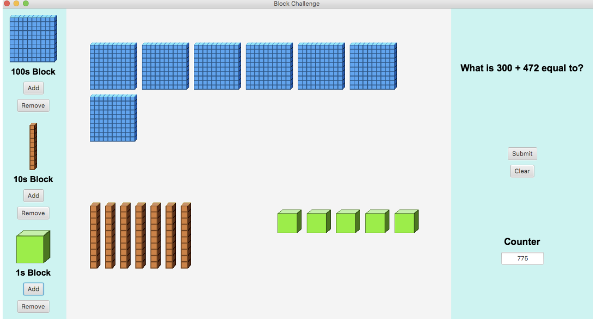

January 14, 2019 - Block Challenge is a GUI application intended for 3rd grade students who are learning the concept of adding and subtracting numbers.  
The application randomly generates an equation (addition / subtraction of numbers) that a students must solve and model by 100s, 10s, and 1s block. 
Once the student believes that they have modeled the correct answer, they can press submit and see if they got the question correct. Instead of using 
Java Swing for this application, I used JavaFx. Learning from the shortcomings of the calculator application, I implemented layout panes throughout this 
application to make it resizable for the user's screen.

This project was a precursor to the Block Challenge Website (Located in the previous directory).

Screenshot of the GUI:

