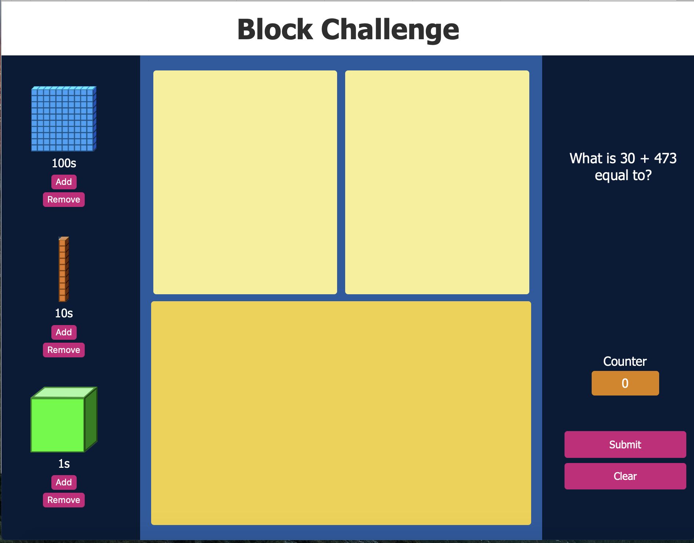

# Block Challenge Website

After creating the Block Challenge GUI, I wanted to create a more flexible, and easier to access alternative. I also wanted to learn more about CSS, HTML, and
Javascript.
One of the most important lessons that I learned while creating the project was to seperate your structure, presentation, and functionality of a website.

Image of the website:

